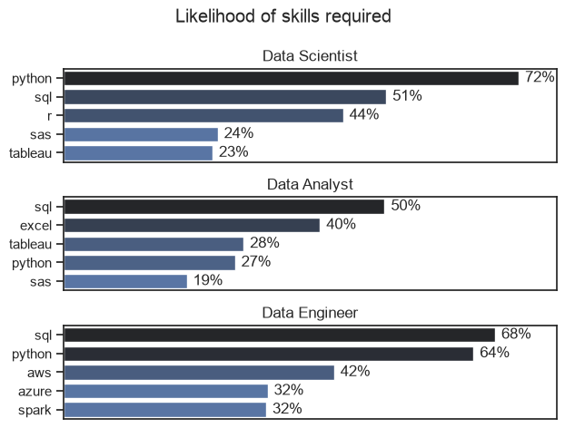
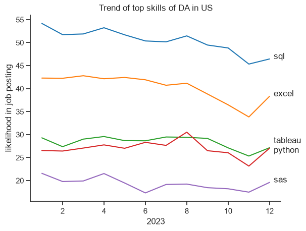

# ANALYSIS 
## 1. What are the most demanding skills for the top 3 roles ?
To find out the most demanded skills for the top 3 roles, I firstly filtered out the positions by which ones were the most popular,and then got the top 5 skills for these top 3 roles. This query highlights the most popular job roles along with their top 5 skills, showing on which skills I should pay attention if I am targeting one of the popular job roles.

View my notebook with detailed steps here : [skills_count.ipynb](Project/skills_count.ipynb)

### Visualize data
``` python
fig,ax = plt.subplots(len(title), 1)
for i, job in enumerate(title):
    df_plot_percentage = df_percentage[df_percentage['job_title_short'] == job].head(5)
    sns.barplot(data=df_plot_percentage, x='Percentage', y='job_skills', ax=ax[i],legend=False, hue= 'Percentage', palette='dark:b_r')
    ax[i].set_title(job)
    ax[i].set_ylabel('')
    ax[i].set_xlabel('')
    ax[i].set_xlim(0, 78)
    ax[i].set_xticks([])
    for n,v in enumerate(df_plot_percentage['Percentage']):
        ax[i].text(v+1, n, f'{int(v)}%', va= 'center')

fig.suptitle('Likelihood of skills required')
fig.tight_layout()
plt.show()
```

### Result


 ### Insights 

* **Data Scientist:** Python is the most prominent skill (72%), followed by SQL (51%) and R (44%), highlighting a strong focus on programming, statistical analysis, and data science.
* **Data Analyst:** SQL (50%) and Excel (40%) lead, with Tableau (28%) and Python (27%) supporting data analysis, visualization, and reporting.
* **Data Engineer:** SQL (68%) and Python (64%) dominate, complemented by AWS (42%), Azure (32%), and Spark (32%), reflecting a strong focus on data infrastructure, cloud, and big-data technologies.
* **Common Skill:** **SQL** is consistently important across all three roles, making it a core technology in the data domain.
* **Role-specific focus:** Data Science emphasizes **Python and statistical tools**, Data Analytics emphasizes **SQL, Excel, and visualization**, while Data Engineering emphasizes **SQL, Python, cloud platforms, and Spark**.
* **Overall takeaway:** The visualization demonstrates that each role has a distinct technology stack, but **SQL and Python form the strongest common technical foundation across the data ecosystem**.

## 2. How are in-demand skills trending for Data Analysts in US ?
To understand how in-demand skills for Data Analysts have evolved over time, I filtered the job postings for Data Analyst roles and analyzed the yearly trend of the top 5 most demanded skills. This analysis highlights the skills that have remained consistently important and those whose demand has changed over time.

View my notebook with detailed steps here:[Skills_trend.ipynb](Project/Skills_trend.ipynb)


### Visualize data

```python
df_plot = df_DA_US_Percent.iloc[:,:5]
sns.lineplot(data= df_plot, dashes=False, palette='tab10')
sns.set_theme(style= 'ticks')
sns.despine()

plt.title('Trend of top skills of DA in US')
plt.xlabel('2023')
plt.ylabel('likelihood in job posting')
plt.legend().remove()


for i in range(5):
    y = df_plot.iloc[-1, i]
    
    if df_plot.columns[i] == 'tableau':
        y += 1
    elif df_plot.columns[i] == 'python':
        y -= 1
        
    plt.text(12.2, y, df_plot.columns[i])
```

### Result

### Insights

* **SQL:** SQL remained the most consistently demanded skill throughout 2023, staying above 45% in every month and reaching a peak of approximately 54% in January. Despite some fluctuations, it remained the strongest skill by the end of the year.

* **Excel:** Excel was the second most demanded skill for most of the year, remaining above 40% during the first half of 2023. Its demand declined during the later months, reaching around 34% in November, before recovering to approximately 38% in December.

* **Tableau and Python:** Tableau and Python showed relatively similar demand throughout the year, generally remaining in the 25–30% range. Python briefly surpassed Tableau around August, while both ended the year at approximately 27%.

* **SAS:** SAS consistently had the lowest demand among the five skills, remaining below 22% throughout most of the year. Its demand declined during the later months before recovering slightly in December.

* **Overall trend:** SQL maintained a clear lead throughout 2023, while Excel showed a noticeable decline after the first half of the year. Tableau, Python, and SAS remained comparatively stable at lower levels, indicating that SQL and Excel were the most consistently demanded skills among the five analyzed.


