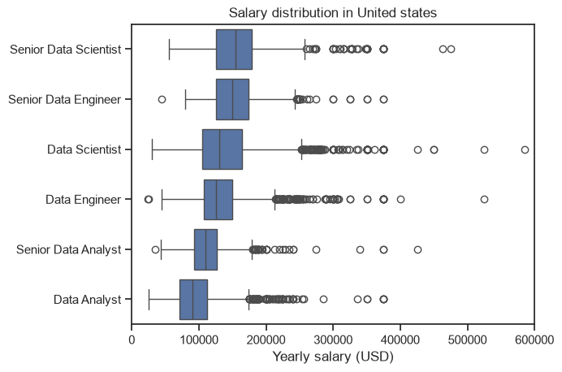
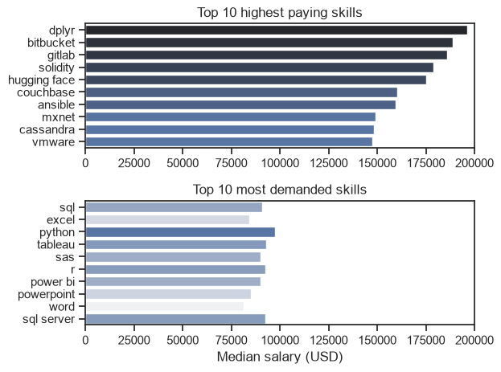
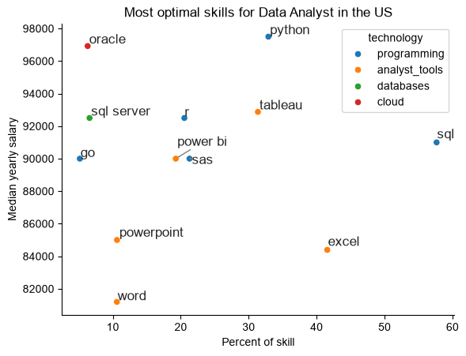

# 📊 Data Analyst Job Market Analysis

### Exploring Skill Demand, Salary Trends & Optimal Skills in the US Data Job Market

This project analyzes the US data job market to understand which skills are most demanded, how skill demand changes over time, how salaries vary across data-related roles, and which skills offer a strong balance between market demand and compensation.

---

## 📌 Overview

This project explores the US data job market with a focus on Data Analyst roles. The analysis examines job postings, skill requirements, salary distributions, and the relationship between skill demand and compensation.

The project aims to answer four key questions:

- What are the most demanded skills across popular data roles?
- How have Data Analyst skill demands changed throughout 2023?
- How do salary distributions vary across different data-related roles?
- Which skills combine strong market demand with competitive compensation?

The analysis was performed using Python, with Pandas for data manipulation and Matplotlib and Seaborn for data visualization.

---

## ❓ Business Questions

The analysis is structured around the following questions:

1. **What are the most demanded skills for the top 3 data roles?**
2. **How are in-demand skills trending for Data Analysts in the US?**
3. **How well do jobs and skills pay across data-related roles?**
4. **Which skills offer a strong combination of demand and compensation for Data Analysts?**

---

## 📂 Dataset

The dataset contains information from US data job postings, including:

- Job titles
- Salary information
- Job locations
- Required skills
- Job posting dates
- Other job-related attributes

The dataset was used to investigate skill demand, salary distributions, skill trends, and the relationship between demand and compensation in the data job market.

---

## 🛠️ Tools & Technologies

| Tool | Purpose |
|---|---|
| **Python** | Data analysis and processing |
| **Pandas** | Data cleaning, transformation and aggregation |
| **Matplotlib** | Data visualization |
| **Seaborn** | Statistical visualization |
| **Jupyter Notebook** | Analysis and experimentation |
| **VS Code** | Development environment |
| **Git & GitHub** | Version control and project sharing |

---

## 🧹 Data Preparation

The dataset was prepared for analysis through the following steps:

- Loaded the dataset and converted it into a Pandas DataFrame
- Converted job-posting dates into datetime format
- Cleaned and converted the skills data into usable Python lists
- Filtered job postings based on country and job role
- Prepared skill frequency and salary metrics for subsequent analysis

---

# ANALYSIS 
## 1. What are the most demanding skills for the top 3 roles ?
To find out the most demanded skills for the top 3 roles, I firstly filtered out the positions by which ones were the most popular,and then got the top 5 skills for these top 3 roles. This query highlights the most popular job roles along with their top 5 skills, showing on which skills I should pay attention if I am targeting one of the popular job roles.

View my notebook with detailed steps here : [skills_count.ipynb](Project/skills_count.ipynb)

### Visualize data
``` python
fig,ax = plt.subplots(len(title), 1)
for i, job in enumerate(title):
    df_plot_percentage = df_percentage[df_percentage['job_title_short'] == job].head(5)
    sns.barplot(data=df_plot_percentage, x='Percentage', y='job_skills', ax=ax[i],legend=False, hue= 'Percentage', palette='dark:b_r')
    ax[i].set_title(job)
    ax[i].set_ylabel('')
    ax[i].set_xlabel('')
    ax[i].set_xlim(0, 78)
    ax[i].set_xticks([])
    for n,v in enumerate(df_plot_percentage['Percentage']):
        ax[i].text(v+1, n, f'{int(v)}%', va= 'center')

fig.suptitle('Likelihood of skills required')
fig.tight_layout()
plt.show()
```

### Result


 ### Insights 

* **Data Scientist:** Python is the most prominent skill (72%), followed by SQL (51%) and R (44%), highlighting a strong focus on programming, statistical analysis, and data science.
* **Data Analyst:** SQL (50%) and Excel (40%) lead, with Tableau (28%) and Python (27%) supporting data analysis, visualization, and reporting.
* **Data Engineer:** SQL (68%) and Python (64%) dominate, complemented by AWS (42%), Azure (32%), and Spark (32%), reflecting a strong focus on data infrastructure, cloud, and big-data technologies.
* **Common Skill:** **SQL** is consistently important across all three roles, making it a core technology in the data domain.
* **Role-specific focus:** Data Science emphasizes **Python and statistical tools**, Data Analytics emphasizes **SQL, Excel, and visualization**, while Data Engineering emphasizes **SQL, Python, cloud platforms, and Spark**.
* **Overall takeaway:** The visualization demonstrates that each role has a distinct technology stack, but **SQL and Python form the strongest common technical foundation across the data ecosystem**.
---
## 2. How are in-demand skills trending for Data Analysts in US ?
To understand how in-demand skills for Data Analysts have evolved over time, I filtered the job postings for Data Analyst roles and analyzed the yearly trend of the top 5 most demanded skills. This analysis highlights the skills that have remained consistently important and those whose demand has changed over time.

View my notebook with detailed steps here:[Skills_trend.ipynb](Project/Skills_trend.ipynb)


### Visualize data

```python
df_plot = df_DA_US_Percent.iloc[:,:5]
sns.lineplot(data= df_plot, dashes=False, palette='tab10')
sns.set_theme(style= 'ticks')
sns.despine()

plt.title('Trend of top skills of DA in US')
plt.xlabel('2023')
plt.ylabel('likelihood in job posting')
plt.legend().remove()


for i in range(5):
    y = df_plot.iloc[-1, i]
    
    if df_plot.columns[i] == 'tableau':
        y += 1
    elif df_plot.columns[i] == 'python':
        y -= 1
        
    plt.text(12.2, y, df_plot.columns[i])
```

### Result

### Insights

* **SQL:** SQL remained the most consistently demanded skill throughout 2023, staying above 45% in every month and reaching a peak of approximately 54% in January. Despite some fluctuations, it remained the strongest skill by the end of the year.

* **Excel:** Excel was the second most demanded skill for most of the year, remaining above 40% during the first half of 2023. Its demand declined during the later months, reaching around 34% in November, before recovering to approximately 38% in December.

* **Tableau and Python:** Tableau and Python showed relatively similar demand throughout the year, generally remaining in the 25–30% range. Python briefly surpassed Tableau around August, while both ended the year at approximately 27%.

* **SAS:** SAS consistently had the lowest demand among the five skills, remaining below 22% throughout most of the year. Its demand declined during the later months before recovering slightly in December.

* **Overall trend:** SQL maintained a clear lead throughout 2023, while Excel showed a noticeable decline after the first half of the year. Tableau, Python, and SAS remained comparatively stable at lower levels, indicating that SQL and Excel were the most consistently demanded skills among the five analyzed.
---
## 3. How well do jobs and skills pay for data analyst

### Salary analysis for top jobs
To understand how salaries vary across different data-related roles, I filtered the job postings for the United States and analyzed the salary distributions of the most common roles. The boxplot highlights differences in median salaries, salary ranges, and outliers, providing a clearer view of compensation patterns across the data domain.

View my notebook with detailed steps here: [Salary_analysis.ipynb](Project/Salary_analysis.ipynb)

### Visualize data

```python
sns.boxplot(data= df_US_top, x= 'salary_year_avg', y='job_title_short', order=job_order)
sns.set_theme(style='ticks')
plt.title('Salary distribution in United states')
plt.xlabel('Yearly salary (USD)')
plt.ylabel('')
plt.xlim(0, 600000)
plt.show()
```

### Result


### Insights

* **Senior Data Scientist:** Shows one of the highest salary distributions, with a median of approximately $150K and several high-end outliers extending beyond $450K.

* **Senior Data Engineer:** Also has a relatively high salary distribution, with a median around $150K and multiple outliers reaching approximately $370K.

* **Data Scientist & Data Engineer:** Both roles show strong salary distributions, with median salaries around $125K–$140K. Data Scientist has a wider spread and several high-value outliers extending beyond $500K.

* **Senior Data Analyst & Data Analyst:** These roles have comparatively lower median salaries, centered around approximately $105K–$120K, with narrower central distributions but several higher-salary outliers.

* **Overall takeaway:** Senior-level Data Scientist and Data Engineer roles show higher central salary distributions, while Data Analyst roles are concentrated at lower salary levels. The numerous high-end outliers across roles indicate substantial variation in compensation within the data domain.

### Highest paid and most demanded skills for data analysis
To understand how individual skills influence compensation and demand, I analyzed the median salaries associated with skills in data-related job postings in the United States. The analysis compares the top 10 highest-paying skills with the top 10 most demanded skills, highlighting the differences between skills that command higher compensation and those that appear most frequently in job postings.

### Visualize data

```python
fig, ax = plt.subplots(2,1)
sns.set_theme(style='ticks')
# highest paying skills
sns.barplot(data=df_salary, x='median', y='job_skills', ax=ax[0], hue= 'median', palette= 'dark:b_r', legend=False )
ax[0].set_title('Top 10 highest paying skills')
ax[0].set_ylabel('')
ax[0].set_xlabel('')
ax[0].set_xlim(0, 200000)

# top demanded skills
sns.barplot(data=df_common, x='median', y='job_skills', ax=ax[1], hue= 'median', palette= 'light:b', legend=False )
ax[1].set_title('Top 10 most demanded skills')
ax[1].set_ylabel('')
ax[1].set_xlabel('Median salary (USD)')
ax[1].set_xlim(0, 200000)
plt.tight_layout()
plt.show()
```

### Result


### Insights

* **Highest-paying skills:** Skills such as Dplyr, Bitbucket, GitLab, Solidity, and Hugging Face show the highest median salaries, with Dplyr approaching $195K and several others exceeding $175K.

* **Most demanded skills:** SQL, Python, Tableau, R, SAS, and Excel appear among the most frequently demanded skills, with SQL and Python showing relatively strong median salaries of approximately $90K–$95K.

* **Demand vs. compensation:** The analysis shows that the most demanded skills are not necessarily the highest-paying skills. Several specialized technologies command substantially higher median salaries despite appearing less frequently in job postings.

* **Core vs. specialized skills:** Common skills such as SQL, Python, Excel, and Tableau appear to provide broad applicability across data roles, while specialized skills such as Solidity, Hugging Face, and cloud-related technologies are associated with higher median compensation.

* **Overall takeaway:** Skill demand and compensation represent different dimensions of the job market. Frequently requested skills may provide broader opportunities, whereas specialized skills can be associated with higher median salaries.
---
## 4.What is the most optimal skill to learn for Data analyst ?
To identify the most valuable skills for Data Analysts, I analyzed the relationship between skill demand and median annual salary in the United States. By comparing the percentage of job postings requiring each skill with its associated median salary, this analysis highlights skills that combine strong market demand with competitive compensation.

View my notebook with detailed steps here: [optimal_skills.ipynb](Project/optimal_skills.ipynb)

### Visualize data

```python
from adjustText import adjust_text
sns.scatterplot(data= df_real_plot, x='skill_percent', y='median', hue='technology' )
sns.despine()
sns.set_theme(style='ticks')

    
# prepare texts for adjustText
texts = []

for i, txt in enumerate(df_DA_US_exp_grp_HD.index):
    text = plt.text(df_DA_US_exp_grp_HD['skill_percent'].iloc[i],df_DA_US_exp_grp_HD['median'].iloc[i],txt)
    texts.append(text)
 # adjust text to avoid overlap

adjust_text(texts,arrowprops=dict(arrowstyle='->', color='gray'))

plt.xlabel('Percent of skill')
plt.ylabel('Median yearly salary')
plt.title('Most optimal skills for Data Analyst in the US')

plt.show()
```

### Result


### Insights

* **Python:** Python combines relatively high demand (~32%) with the highest median salary among the commonly demanded programming skills (~$97K), making it a strong balance between market demand and compensation.

* **SQL:** SQL has the highest demand (~58%) but a lower median salary (~$91K) than Python, indicating that its value is driven primarily by its broad demand across Data Analyst roles.

* **Tableau and R:** Tableau (~33%, ~$93K) and R (~21%, ~$92.5K) offer a relatively strong combination of demand and compensation, positioning them as valuable analytical skills.

* **Specialized skills:** Oracle and SQL Server show relatively high median salaries despite lower demand, suggesting that specialized database or cloud-related expertise can command competitive compensation.

* **Overall takeaway:** The analysis shows that the most optimal skill is not necessarily the skill with the highest demand or the highest salary alone. Skills such as Python, Tableau, and R demonstrate a stronger balance between market demand and compensation, while SQL stands out for its exceptionally broad demand.
---
## 📚 What I Learned

This project strengthened my understanding of the complete data-analysis workflow, from data preparation and exploration to visualization and insight generation.

### Technical Skills

- Data cleaning and transformation using **Pandas**
- Filtering, grouping, aggregation, and statistical analysis
- Data visualization using **Matplotlib and Seaborn**
- Creating and interpreting bar charts, line plots, boxplots, and scatter plots
- Working with skill-demand and salary data

### Analytical Skills

- Translating business questions into data-analysis problems
- Identifying trends and patterns in job-market data
- Comparing skill demand with salary levels
- Communicating findings through clear and concise visualizations
- Turning quantitative results into actionable insights
## 🔑 Key Takeaways

- **SQL is the most consistently demanded skill:** SQL ranks highly across Data Science, Data Analytics, and Data Engineering and remained the most demanded skill among Data Analysts throughout 2023.

- **Python has strong cross-role relevance:** Python is the leading skill for Data Scientists (72%) and is also highly demanded for Data Engineers (64%). For Data Analysts, it combines relatively high demand with a median salary of approximately $97K.

- **Data Analyst skills show different demand patterns:** SQL and Excel remained the most prominent skills for Data Analysts, while Tableau and Python maintained relatively stable demand throughout most of 2023.

- **Salary varies substantially by role:** Senior Data Scientist and Senior Data Engineer roles showed higher median salary distributions than Data Analyst roles, while substantial outliers indicate considerable variation within individual roles.

- **High demand does not always mean high compensation:** SQL had the highest demand among the analyzed Data Analyst skills, but several less frequently requested specialized skills showed higher median salaries.

- **Demand and compensation should be considered together:** The demand–salary analysis shows that skills such as Python, Tableau, and R occupy a relatively strong position across both dimensions, while SQL stands out for its exceptionally broad demand.

- **Core and specialized skills serve different purposes:** Widely used skills such as SQL, Python, and Excel offer broad applicability across data roles, whereas specialized technologies can be associated with higher compensation despite lower frequency in job postings.

### Overall Takeaway
The analysis shows that the data job market rewards a combination of **broadly applicable technical skills and specialized expertise**. Skill demand, salary, and role requirements represent different dimensions of the market, so evaluating them together provides a more complete picture of the skills relevant to data careers.

## ⚙️ Challenges I Faced

- **Data Cleaning:** Handling missing and inconsistent values in job, salary, and skill-related fields required careful preprocessing before analysis.

- **Skill Analysis:** Converting skill information into a consistent and analyzable format was necessary to accurately compare skill demand across different roles.

- **Data Interpretation:** Comparing skill demand, salary distributions, and trends required selecting appropriate metrics and visualizations to communicate the findings clearly.

## 🏁 Conclusion

This project provided a data-driven view of the US data job market by examining skill demand, skill trends, salary distributions, and the relationship between demand and compensation.

The analysis highlights that the most frequently demanded skills are not necessarily the highest-paying skills, while specialized skills can show competitive compensation despite lower demand. Overall, considering both skill demand and compensation provides a more complete perspective on the skills and opportunities within the data job market.

This project also strengthened my ability to work with real-world job-market data, perform analysis using Python and Pandas, and communicate findings through effective data visualizations.